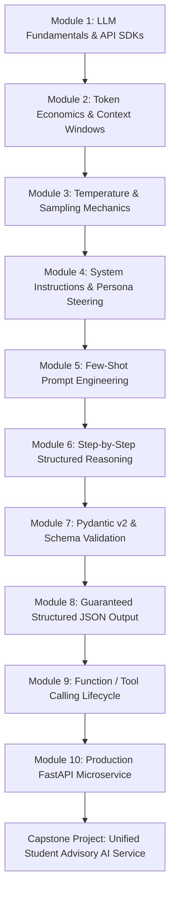

# Generative AI & Agentic AI Engineering — Learning Roadmap

**Prepared by Dr. Rameshwer**  
*Full-Stack AI Engineer | React.js | TypeScript | Node.js | Python | RAG | Agentic AI | LangGraph | Building AI-Powered Applications*  
*Self-Paced Training Resource | 100% Self-Evaluated Learning Trajectory*

---

## Pedagogical Philosophy

This course follows the **Micro-Progression Model**:
$$\text{Core Concept} \longrightarrow \text{Micro-Program (10--40 lines)} \longrightarrow \text{Line-by-Line Analysis} \longrightarrow \text{Self-Experimentation} \longrightarrow \text{Automated Tests} \longrightarrow \text{Microservice Integration}$$

All modules provide instant solutions, automated tests, and verification criteria for complete self-evaluation.

---

## Module Overview & Learning Flow

---

## Detailed Topic-by-Topic Breakdown

### Stage 1: API Foundations & Core Mechanics
| Module | Core Concept | Key Python Skills | Micro-Example | Target Outcome |
| :--- | :--- | :--- | :--- | :--- |
| **01** | **First LLM Call** | `import`, `os.getenv`, `try/except`, Client initialization | `01_hello_llm.py` | Programmatic invocation, credential safety, and response extraction |
| **02** | **Token Economics** | Metadata parsing, integer arithmetic, string manipulation | `02_token_inspector.py` | Measuring prompt tokens, completion tokens, latency, and cost |
| **03** | **Generation Settings** | Config objects, floating-point parameters, keyword arguments | `03_temperature.py` | Mastering temperature, top-p, top-k, and reproducibility boundaries |

### Stage 2: Prompt Engineering & Persona Steering
| Module | Core Concept | Key Python Skills | Micro-Example | Target Outcome |
| :--- | :--- | :--- | :--- | :--- |
| **04** | **System Instructions** | Role separation, multi-turn messages, string formatting | `04_system_instruction.py` | Defining rigid behavioral constraints, academic tone, and security limits |
| **05** | **Few-Shot Prompting** | Lists of dictionaries, f-strings, pattern matching | `05_few_shot.py` | Teaching classification and format consistency via input/output exemplars |
| **06** | **Structured Reasoning** | Problem decomposition, intermediate step extraction | `06_reasoning.py` | Guiding the model to show observable calculation steps before answering |

### Stage 3: Type Safety & Structured Data
| Module | Core Concept | Key Python Skills | Micro-Example | Target Outcome |
| :--- | :--- | :--- | :--- | :--- |
| **07** | **Pydantic v2 Basics** | Classes, `BaseModel`, type annotations, `Field`, `ValidationError` | `07_pydantic_basics.py` | Data validation, constraints, serialization, and schema generation |
| **08** | **Structured Output** | Schema enforcement, JSON parsing, model validation | `08_structured_output.py` | Forcing LLM responses to conform strictly to Pydantic schemas |

### Stage 4: Agentic Tool Calling & Web Microservices
| Module | Core Concept | Key Python Skills | Micro-Example | Target Outcome |
| :--- | :--- | :--- | :--- | :--- |
| **09** | **Tool / Function Calling** | Function docstrings, inspect, JSON schema tools, execution loop | `09_tool_calling.py` | Empowering LLMs with live database lookups and computation engines |
| **10** | **FastAPI AI Microservice** | `@app.post`, `async def`, `HTTPException`, OpenAPI `/docs` | `10_fastapi_ai.py` | Deploying robust, documented asynchronous REST endpoints |

### Stage 5: Capstone Architecture
| Project | Description | Integrated Components | Directory |
| :--- | :--- | :--- | :--- |
| **Capstone Service** | **Student Academic Advisory AI Service** | Config + Pydantic + Tool Calling + Structured Reasoning + FastAPI REST API | `week03-generative-ai/capstone/` |
