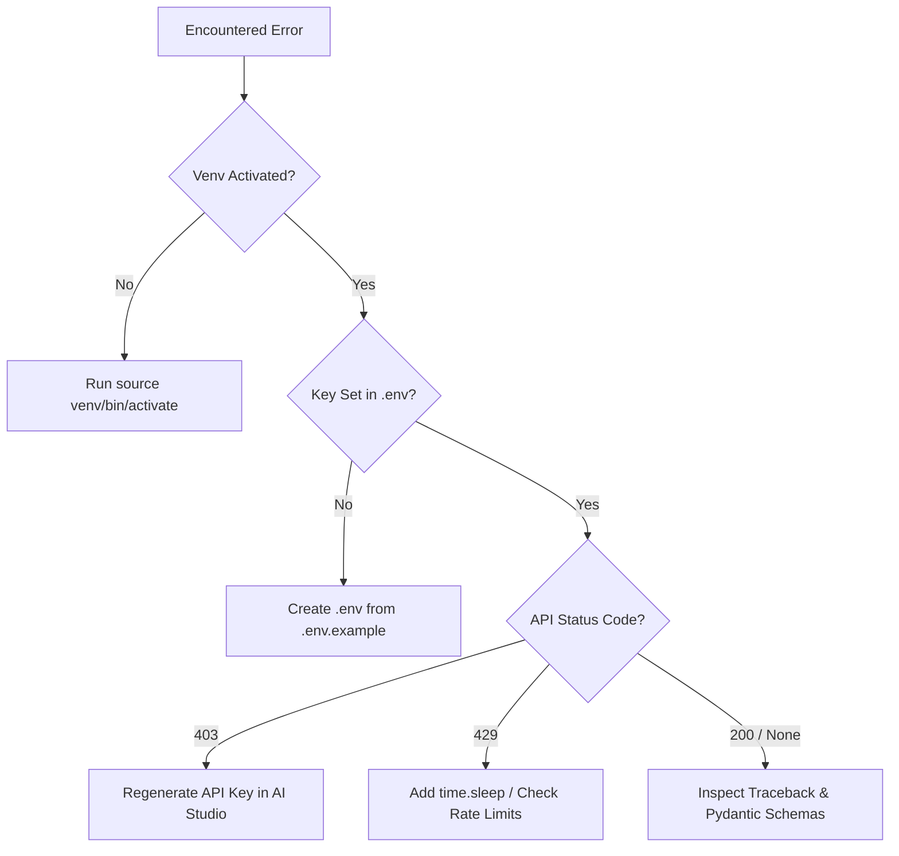

# Troubleshooting & Debugging Handbook

**Prepared by Dr. Rameshwer**  
*Full-Stack AI Engineer | React.js | TypeScript | Node.js | Python | RAG | Agentic AI | LangGraph | Building AI-Powered Applications*  
*Common Developer Errors, Diagnostic Steps, and Solutions*

---

## 1. Virtual Environment & Package Installation Issues

### Issue 1.1: `ModuleNotFoundError: No module named 'google.genai'` or `No module named 'fastapi'`
* **Cause**: The active terminal does not have the virtual environment activated, or dependencies were installed into a different Python interpreter.
* **Diagnostic Command**:
  ```bash
  which python    # On macOS/Linux
  where python    # On Windows
  ```
* **Solution**:
  1. Verify the prompt begins with `(venv)`.
  2. Activate the virtual environment:
     ```bash
     source venv/bin/activate       # macOS / Linux
     venv\Scripts\activate          # Windows
     ```
  3. Re-run:
     ```bash
     pip install -r requirements.txt
     ```

---

## 2. API Key and Credential Issues

### Issue 2.1: `ValueError: GEMINI_API_KEY environment variable not set`
* **Cause**: Python cannot find your API key because `.env` is missing or `python-dotenv` has not loaded it.
* **Diagnostic Check**:
  Check if `.env` exists in the workspace root:
  ```bash
  ls -la .env
  ```
* **Solution**:
  1. Ensure you copied `.env.example` to `.env`.
  2. Ensure `.env` contains:
     ```env
     GEMINI_API_KEY=AIzaSy...
     ```
  3. In your Python script, ensure `load_dotenv()` is called before accessing `os.getenv("GEMINI_API_KEY")`.

### Issue 2.2: `403 Forbidden` or `API key not valid`
* **Cause**: The API key is miscopied, contains leading/trailing whitespace, or is expired/deactivated.
* **Solution**:
  1. Open [Google AI Studio](https://aistudio.google.com/) and generate a new key.
  2. Copy and paste it without quotation marks or spaces into `.env`.

### Issue 2.3: `429 Resource Exhausted` / Rate Limit Exceeded
* **Cause**: The free tier quota for requests per minute (RPM) or tokens per minute (TPM) was reached.
* **Solution**:
  1. Introduce a short delay using `time.sleep(2)` between consecutive requests.
  2. Use a smaller model such as `gemini-2.5-flash`.

---

## 3. Pydantic & Schema Validation Errors

### Issue 3.1: `pydantic_core._pydantic_core.ValidationError`
* **Cause**: Input data provided to a Pydantic model does not match the expected data type or violates a `Field` constraint (e.g., passing a string where an integer is required).
* **Diagnostic Approach**:
  Print the raw error output:
  ```python
  try:
      StudentProfile(name="Alice", age="not_a_number", gpa=3.8)
  except ValidationError as e:
      print(e.json())  # Inspect the exact field and reason
  ```
* **Solution**:
  Ensure input types conform to the type annotations defined on your `BaseModel` subclass.

---

## 4. FastAPI & Uvicorn Issues

### Issue 4.1: `Address already in use` (Port 8000 Conflict)
* **Cause**: Another service or a previous instance of Uvicorn is already running on port 8000.
* **Diagnostic Command**:
  ```bash
  # macOS / Linux: Find process using port 8000
  lsof -i :8000
  ```
* **Solution**:
  1. Terminate the existing process:
     ```bash
     kill -9 <PID>
     ```
  2. Or start Uvicorn on an alternative port:
     ```bash
     uvicorn week03-generative-ai.examples.10_fastapi_ai:app --reload --port 8001
     ```

### Issue 4.2: Swagger UI (`/docs`) Not Loading or Showing Internal Server Error
* **Cause**: An uncaught syntax error or schema misconfiguration inside route handlers.
* **Solution**:
  Check the terminal where Uvicorn is running for the full Python traceback and ensure all path operations return instances matching `response_model`.

---

## 5. Summary Diagnostic Workflow


