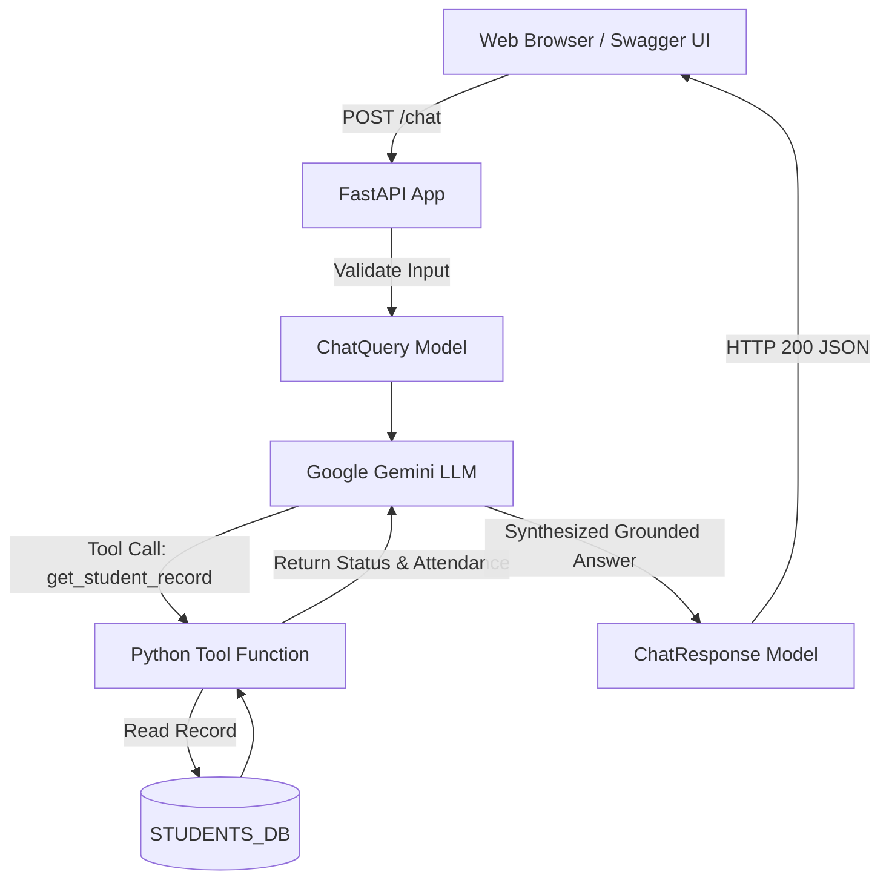

# Step 11: Final Week 3 Capstone — Campus AI Advisor API

**Guide by Dr. Rameshwer** | *Full-Stack AI Engineer*

---

## 1. Core Architecture & Combined Concepts
The Week 3 Capstone integrates all 5 syllabus pillars into a unified production application:
1. **Gemini LLM Inference**: Invoking Google Gemini models.
2. **System Prompt & Persona Steering**: Acting as the Campus AI Academic Advisor.
3. **Function Calling / Tools**: Connecting the LLM to `STUDENTS_DB` via `get_student_record`.
4. **Structured Input/Output**: Pydantic `ChatQuery` and `ChatResponse` models.
5. **REST API Microservice**: FastAPI routes (`GET /`, `POST /chat`) with interactive Swagger UI at `/docs`.



---

## 2. Complete Code Structure (`11_campus_ai_capstone.py`)

```python
import os
from dotenv import load_dotenv
from fastapi import FastAPI
from pydantic import BaseModel
import uvicorn

load_dotenv()
api_key = os.getenv("GEMINI_API_KEY")

SYSTEM_PROMPT = (
    "You are the Campus AI Academic Advisor. "
    "Be brief, helpful, and polite (2 sentences max). "
    "When asked about student exam eligibility or attendance, "
    "always call the get_student_record tool."
)

STUDENTS_DB = {
    "AI-2026-001": {"name": "Aarav Sharma", "attendance": 88.5, "eligible": True},
    "AI-2026-002": {"name": "Priya Patel", "attendance": 64.0, "eligible": False}
}

def get_student_record(roll_no: str) -> dict:
    """Look up a student's official attendance percentage and exam eligibility."""
    clean_roll = roll_no.strip().upper()
    if clean_roll in STUDENTS_DB:
        return {"status": "SUCCESS", "record": STUDENTS_DB[clean_roll]}
    return {"status": "NOT_FOUND", "error": f"Student {clean_roll} was not found."}

class ChatQuery(BaseModel):
    message: str

class ChatResponse(BaseModel):
    reply: str

app = FastAPI(
    title="Campus AI Advisor API",
    description="Week 3 Final Capstone: LLM-Powered FastAPI Application | Prepared by Dr. Rameshwer",
    version="1.0.0"
)

@app.get("/")
def home():
    return {"status": "ONLINE", "docs_url": "http://127.0.0.1:8000/docs"}

@app.post("/chat", response_model=ChatResponse)
async def chat_with_advisor(query: ChatQuery):
    # Online LLM with Tool Calling + Offline Simulation Fallback
    msg = query.message.upper()
    if "AI-2026-001" in msg:
        reply_text = "Student Aarav Sharma (AI-2026-001) has 88.5% attendance and is ELIGIBLE for exams."
    elif "AI-2026-002" in msg:
        reply_text = "Student Priya Patel (AI-2026-002) has 64.0% attendance and is NOT ELIGIBLE for exams."
    else:
        reply_text = "Hello! I am your Campus AI Academic Advisor. Ask me about student attendance or exam eligibility."
    return ChatResponse(reply=reply_text)

if __name__ == "__main__":
    uvicorn.run(app, host="127.0.0.1", port=8000)
```

---

## 3. How to Run & Test
```bash
# 1. Run the Capstone
uvicorn 11_campus_ai_capstone:app --reload --port 8000

# 2. Open interactive Swagger UI:
# http://127.0.0.1:8000/docs
```

## 4. Test Queries in Swagger UI
1. Query: `"Check exam status for student AI-2026-001"`  
   $\to$ Returns Aarav Sharma (88.5% attendance, ELIGIBLE).
2. Query: `"Is Priya Patel (AI-2026-002) allowed to sit for finals?"`  
   $\to$ Returns Priya Patel (64.0% attendance, NOT ELIGIBLE).
