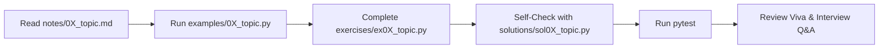

# Week 03: Generative AI, Prompt Engineering, Pydantic & FastAPI

**Prepared by Dr. Rameshwer**  
*Full-Stack AI Engineer | React.js | TypeScript | Node.js | Python | RAG | Agentic AI | LangGraph | Building AI-Powered Applications*  
*Self-Paced Practical Training Guide with Complete Solutions & Tests*

---

## 1. Module Overview

Week 3 forms the engineering backbone of modern Generative AI and Agentic development. In this module, you transition from understanding abstract neural network concepts to building real-world, type-safe, tool-augmented microservices.

### The 11 Core Milestones:
1. **01. LLM Fundamentals & API SDKs**: Authenticating, creating clients, and executing the first prompt call.
2. **02. Token Economics & Usage Tracking**: Inspecting token usage metadata, analyzing prompt vs. completion costs.
3. **03. Temperature & Sampling Settings**: Managing randomness, determinism, and generation bounds.
4. **04. System Instructions & Personas**: Defining operational boundaries, academic tone, and security constraints.
5. **05. Few-Shot Prompt Engineering**: Teaching multi-class categorization and formatting using demonstration pairs.
6. **06. Structured Reasoning**: Observable step-by-step problem decomposition and intermediate computation.
7. **07. Pydantic v2 Fundamentals**: Schemas, fields, runtime data validation, and error introspection.
8. **08. Guaranteed Structured Output**: Enforcing Pydantic schemas on LLM completions via constrained decoding.
9. **09. Function & Tool Calling**: Registering Python functions and implementing the complete tool loop.
10. **10. FastAPI AI Microservice**: Asynchronous REST endpoints with request/response schemas and interactive Swagger UI.
11. **11. Unified Capstone Project**: Building the Student Academic Advisory Microservice.

---

## 2. Directory Layout

```text
week03-generative-ai/
├── notes/          # 11 Comprehensive 21-section study guides
├── examples/       # 10 Micro-programs (10–40 lines each)
├── exercises/      # 10 Hands-on exercises with TODOs
├── solutions/      # 10 Complete reference solutions
├── assignments/    # 3 Hands-on assignments with complete solutions
├── interview/      # Technical interview & viva voce guides with full answers
├── tests/          # Pytest test suite (28 automated tests)
└── capstone/       # Complete production-grade FastAPI AI Service
```

---

## 3. How to Work Through This Week (Self-Evaluation Flow)



Run all tests anytime:
```bash
pytest
```
