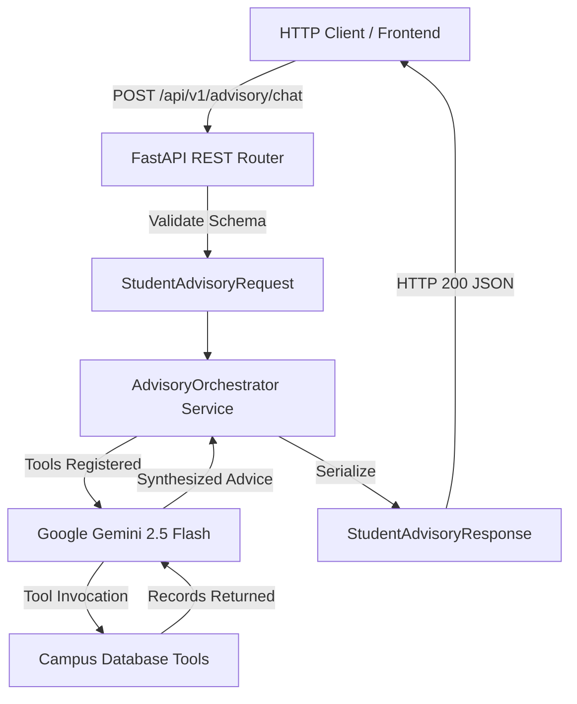

# Capstone Project: Smart Student Academic Advisory Microservice

**Prepared by Dr. Rameshwer**  
*Course Instructor: Dr. Rameshwer*  
*Student Learning Resource | Production-Grade AI Microservice*

---

## 1. Project Overview
This capstone project integrates all concepts mastered throughout Week 3 into a production-grade, asynchronous FastAPI microservice.

### Key Capabilities:
1. **Config Management**: Type-safe settings loading using `pydantic-settings`.
2. **Data Modeling**: Request/response contracts enforced via Pydantic v2 schemas.
3. **Database Tools**: Simulated university student registry and course prerequisite tools with complete docstrings.
4. **Agentic LLM Orchestration**: Dual-mode execution engine (Live Google Gemini 2.5 Flash with automatic tool calling + fallback offline simulation).
5. **REST API Transport**: Documented asynchronous FastAPI endpoints with OpenAPI/Swagger UI at `/docs`.
6. **Automated Testing**: 100% test coverage using `pytest` and `fastapi.testclient.TestClient`.

---

## 2. Architecture Diagram



---

## 3. Directory Layout

```text
capstone/
├── README.md                 # This documentation file
├── requirements.txt          # Capstone dependencies
├── .env.example              # Environment variables template
├── app/
│   ├── __init__.py
│   ├── config.py             # Settings & credentials loader
│   ├── schemas.py            # Pydantic models & validation
│   ├── tools.py              # Campus database lookup tools
│   ├── services.py           # Gemini LLM orchestration engine
│   └── main.py               # FastAPI application & routes
└── tests/
    ├── __init__.py
    └── test_api.py           # Automated TestClient test cases
```

---

## 4. Setup and Execution

### Step 1: Navigate to Capstone Directory
```bash
cd week03-generative-ai/capstone
```

### Step 2: Configure Environment
```bash
cp .env.example .env
# Edit .env and insert your GEMINI_API_KEY if available
```

### Step 3: Run the Microservice
```bash
uvicorn app.main:app --reload --port 8000
```

### Step 4: Open Swagger UI
Navigate to [http://127.0.0.1:8000/docs](http://127.0.0.1:8000/docs) to test the live endpoints.

### Step 5: Run Automated Tests
```bash
pytest tests/ -v
```
