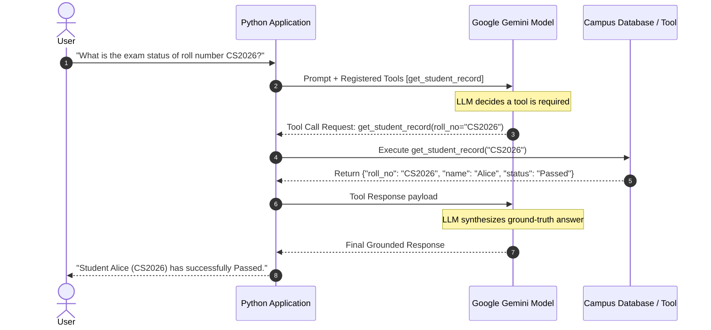

# Topic 09: Function & Tool Calling Lifecycle

**Prepared by Dr. Rameshwer**  
*Course Instructor: Dr. Rameshwer*  
*Student Learning Resource | Practical Module 09*

---

## 1. Learning Objectives
By the end of this topic, you will be able to:
1. Understand why LLMs cannot directly access real-time databases or execute arbitrary code.
2. Define Python functions as LLM tools with clear docstrings and type annotations.
3. Understand the complete 5-step Tool Calling Lifecycle.
4. Execute local tool functions dynamically based on model requests.
5. Return tool results to the model to generate grounded final responses.

---

## 2. Why Are We Learning This?
LLMs are frozen in time at their training cutoff date and have no access to private company databases, live weather, real-time campus records, or arithmetic execution environments. **Tool Calling** turns an LLM from a passive text generator into an active, grounded reasoning agent capable of interacting with the real world.

---

## 3. Concept in Simple Words
The LLM does **not** run your Python code. Instead:
1. You tell the LLM: *"I have a tool called `get_student_grade(roll_no)`"*.
2. The user asks: *"Did roll number CS101 pass?"*
3. The LLM tells you: *"Please run `get_student_grade(roll_no='CS101')` for me."*
4. You run the function in Python, look up the database, and get `{"grade": "A", "status": "Passed"}`.
5. You send this data back to the LLM.
6. The LLM replies to the user: *"Yes, student CS101 passed with grade A."*

---

## 4. Real-World Analogy
Think of a surgeon in an operating room:
* The **Surgeon (LLM)** makes the medical decision: *"Pass me scalpel #4"*.
* The **Surgical Nurse (Python Backend)** retrieves and hands over scalpel #4.
* The Surgeon uses the scalpel to complete the procedure. The surgeon doesn't leave the room to forge the tool.

---

## 5. Technical Explanation (The 5-Step Lifecycle)



---

## 6. Important Terminology
* **Tool / Function Calling**: Model ability to emit structured function calls rather than text.
* **Function Signature**: Name, arguments, types, and return type of a Python callable.
* **Docstring**: The `"""..."""` documentation inside a function describing its purpose and parameter meanings.
* **Tool Execution Loop**: The orchestrator that intercepts tool requests, invokes the local function, and returns output to the model.

---

## 7. Python Syntax & Concepts Encountered
* Python docstrings: `def func(): """Docstring here."""`
* `types.GenerateContentConfig(tools=[function_reference])`
* Inspecting `response.function_calls` / `response.candidates[0].content.parts`.

---

## 8. Smallest Working Example (`09_tool_calling.py`)

```python
import os
from dotenv import load_dotenv
from google import genai
from google.genai import types

load_dotenv()
client = genai.Client(api_key=os.getenv("GEMINI_API_KEY"))

# Simulated Campus Database
STUDENT_DATABASE = {
    "CS2026": {"name": "Alice Smith", "major": "Computer Science", "status": "Passed", "gpa": 3.9},
    "CS2027": {"name": "Bob Jones", "major": "Data Science", "status": "Pending", "gpa": 3.2}
}

# Step 1: Define the Python tool function with clear docstrings and type hints
def get_student_record(roll_no: str) -> dict:
    """Retrieves academic record and exam status for a student by roll number.

    Args:
        roll_no: The unique student roll number string (e.g. 'CS2026').

    Returns:
        A dictionary containing student name, major, status, and GPA, or an error.
    """
    roll_no = roll_no.strip().upper()
    if roll_no in STUDENT_DATABASE:
        return {"found": True, "record": STUDENT_DATABASE[roll_no]}
    return {"found": False, "error": f"Student with roll number '{roll_no}' was not found."}

# Step 2: Configure generation with the tool registered
config = types.GenerateContentConfig(
    tools=[get_student_record],
    temperature=0.0
)

# Step 3: Send user query requiring tool execution
prompt = "Can you check the academic standing and exam status for student CS2026?"
print(f"User Query: {prompt}\n")

response = client.models.generate_content(
    model="gemini-2.5-flash",
    contents=prompt,
    config=config
)

# In the modern google-genai SDK, when a function is passed directly in tools,
# automatic function calling executes the local function and returns the final response!
print("--- Final Model Response (Grounded via Tool) ---")
print(response.text)
```

---

## 9. Code Explanation — Line by Line
* **Lines 10-13**: Sets up a simulated dictionary database `STUDENT_DATABASE`.
* **Lines 16-27**: Defines `get_student_record`. The docstring is critical: Google Gemini reads this docstring to understand what parameters are expected.
* **Lines 30-33**: Registers the function reference directly inside `tools=[get_student_record]`.
* **Lines 36-42**: Invokes `generate_content`. The SDK automatically identifies the function call, executes `get_student_record("CS2026")`, passes the return dictionary back to the model, and yields the final natural language answer.
* **Lines 47-48**: Prints the grounded final answer.

---

## 10. Expected Output
```text
User Query: Can you check the academic standing and exam status for student CS2026?

--- Final Model Response (Grounded via Tool) ---
Student Alice Smith (roll number CS2026), majoring in Computer Science, has an academic standing with a GPA of 3.9 and has successfully passed her exams.
```

---

## 11. How to Run
```bash
python week03-generative-ai/examples/09_tool_calling.py
```

---

## 12. Experiment Yourself
1. Query an unknown student: `"Check the status of student CS9999"`. Observe how the tool returns `"found": False` and the model politely informs the user that the record was not found.
2. Add a second tool: `calculate_tuition_fee(credits: int, is_resident: bool) -> float` and test multi-tool prompts!

---

## 13. Common Mistakes
1. **Missing or Vague Docstrings**: If a tool function lacks a docstring, the LLM has no description to know what the tool does or when to call it.
2. **Missing Type Annotations**: Forgetting `roll_no: str` causes tool argument schema compilation to fail.

---

## 14. Debugging Exercise
**Buggy Code**:
```python
# Missing docstring and parameter type hint:
def lookup(id):
    return DB.get(id)
```
**Fix**: Add type annotations (`id: str`) and full docstrings describing parameters and return structures.

---

## 15. Student Practice Task
Create a script `ex09_custom_tool.py` that implements a tool `get_library_book_status(isbn: str) -> dict` and answers queries about book availability on campus.

---

## 16. Mini Challenge
Implement a calculator tool `evaluate_math_expression(expression: str) -> float` and observe the LLM invoking the tool whenever arithmetic questions are asked.

---

## 17. Real-World Industry Use
Tool calling powers SQL query generators, CRM integrations (Salesforce, Zendesk), automated calendar schedulers, and live stock market analysis bots.

---

## 18. Viva Questions
1. *Does the LLM execute Python functions directly on the remote server?*  
   **Answer**: No. The LLM only generates the function name and arguments in JSON. The local application executes the function and returns the result.
2. *Why are Python docstrings mandatory for LLM tools?*  
   **Answer**: The docstring becomes the tool description in the OpenAPI JSON Schema transmitted to the model's attention mechanism.

---

## 19. Interview Questions
1. *How do you prevent security vulnerabilities (like SQL injection or arbitrary code execution) when executing LLM-generated tool calls?*  
   **Answer**: Validate arguments against strict Pydantic schemas, use parameterized SQL queries, restrict tools to read-only endpoints where appropriate, and implement human-in-the-loop authorization for destructive actions.

---

## 20. Quick Revision
* Define function with **type annotations** and **comprehensive docstrings**.
* Pass to `GenerateContentConfig(tools=[func])`.
* The tool loop grounds model answers in real-time data.

---

## 21. Checklist
- [ ] Understand 5-step Tool Calling lifecycle
- [ ] Executed `09_tool_calling.py`
- [ ] Tested unknown student lookup behavior
- [ ] Completed the library book status practice task
