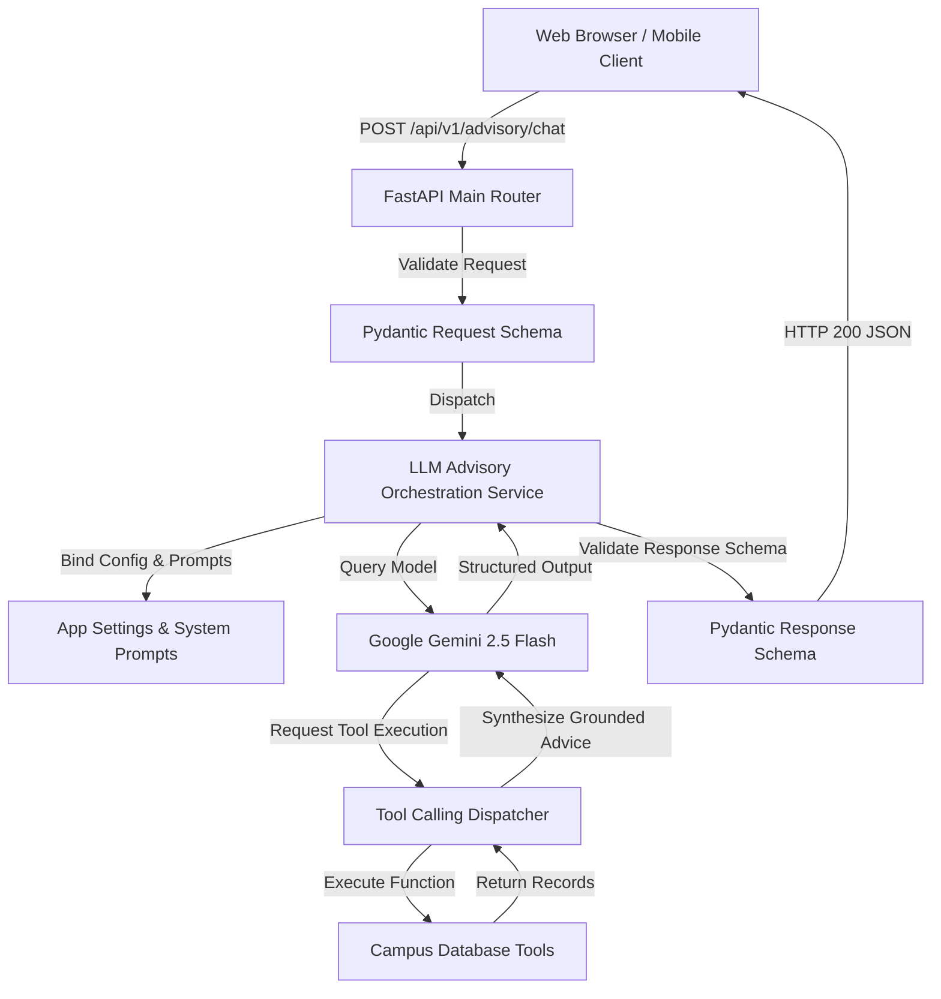

# Topic 11: End-to-End Capstone AI Advisory Microservice

**Prepared by Dr. Rameshwer**  
*Course Instructor: Dr. Rameshwer*  
*Student Learning Resource | Capstone Project Architecture Guide*

---

## 1. Learning Objectives
By the end of this capstone topic, you will be able to:
1. Integrate all 10 preceding concepts into a single production-grade AI microservice.
2. Structure a professional multi-file backend repository (`config`, `schemas`, `tools`, `services`, `main`).
3. Combine Pydantic validation, structured reasoning, live database tool calling, and FastAPI endpoints.
4. Write automated integration tests with `pytest` and `httpx.AsyncClient` / `TestClient`.

---

## 2. Why Are We Learning This?
In industry software engineering, isolated 20-line scripts are not enough. Production systems require clean separation of concerns: configuration management, schema definition, business service logic, external tool integration, and web transport layers.

---

## 3. Concept in Simple Words
The Capstone is a **Smart Academic Advisor Microservice**. A student can query their academic status, ask for course recommendations, or check prerequisites. The service:
1. Validates the request via Pydantic.
2. Uses Google Gemini to analyze the query.
3. Automatically queries the campus student database tool when necessary.
4. Generates verified, type-safe advice.
5. Returns a structured JSON response over FastAPI.

---

## 4. Real-World Analogy
Think of an integrated University Advisory Center:
* **Receptionist (FastAPI Router)**: Welcomes students, checks their ID badge (`schemas.py`).
* **Advisor (Service / LLM)**: Analyzes student needs, formulates recommendations (`services.py`).
* **University Registrar Database (Tools)**: Lookups student transcripts, GPA, and course catalogue (`tools.py`).
* **Dean's Policy Guidelines (Config / Prompts)**: Ensures standard grading rules and safety constraints (`config.py`).

---

## 5. Technical Architecture



---

## 6. Directory Layout of the Capstone Project

```text
week03-generative-ai/capstone/
├── README.md                 # Project documentation & run guide
├── requirements.txt          # Capstone dependencies
├── .env.example              # Environment variables template
├── app/
│   ├── __init__.py           # Package marker
│   ├── config.py             # Pydantic Settings & environment loader
│   ├── schemas.py            # Pydantic request/response schemas
│   ├── tools.py              # Campus database tools (student records, courses)
│   ├── services.py           # LLM client orchestration & tool handling
│   └── main.py               # FastAPI application & route endpoints
└── tests/
    ├── __init__.py
    └── test_api.py           # Comprehensive TestClient integration tests
```

---

## 7. Component Responsibilities

### 1. `config.py` (Settings Management)
Uses `pydantic_settings.BaseSettings` to load `GEMINI_API_KEY`, `GEMINI_MODEL`, and app settings with automatic type validation.

### 2. `schemas.py` (Data Models)
Defines `StudentAdvisoryRequest`, `StudentAdvisoryResponse`, `StudentRecord`, and `CourseInfo`.

### 3. `tools.py` (Tool Definitions)
Contains testable local functions:
* `get_student_academic_record(roll_no: str) -> dict`
* `get_course_prerequisites(course_code: str) -> dict`

### 4. `services.py` (LLM Engine)
Encapsulates client initialization, system prompt configuration, tool registration, and error handling.

### 5. `main.py` (FastAPI Application)
Declares the FastAPI instance, `/health` route, `/api/v1/advisory/chat` route, and lifespan startup events.

### 6. `tests/test_api.py` (Integration Testing)
Automates testing of health checks, valid student lookups, invalid requests, and fallback modes.

---

## 8. How to Run and Test the Capstone

```bash
# 1. Navigate to the capstone directory
cd week03-generative-ai/capstone

# 2. Run the microservice with Uvicorn
uvicorn app.main:app --reload --port 8000

# 3. Open interactive documentation in your browser
# http://127.0.0.1:8000/docs

# 4. Run automated tests
pytest tests/
```

---

## 9. Viva & Technical Interview Discussion

### Viva Question:
*How does modular separation of concerns improve maintainability in AI systems?*
* **Answer**: It isolates external API changes from business logic. If the LLM provider changes, only `services.py` needs an update, while route definitions (`main.py`) and data validation (`schemas.py`) remain untouched.

### Interview Question:
*How do you handle graceful degradation when the LLM provider experiences an outage?*
* **Answer**: Implement circuit-breaker patterns, timeout thresholds, fallbacks to rule-based or cached responses, and return informative HTTP status codes (`503 Service Unavailable`) rather than crashing the worker.

---

## 10. Capstone Completion Checklist
- [ ] Read and understand the multi-layer architecture
- [ ] Inspected `app/config.py`, `schemas.py`, `tools.py`, `services.py`, and `main.py`
- [ ] Executed Uvicorn server and tested via `/docs`
- [ ] All Pytest test cases in `tests/test_api.py` passing with 100% success
